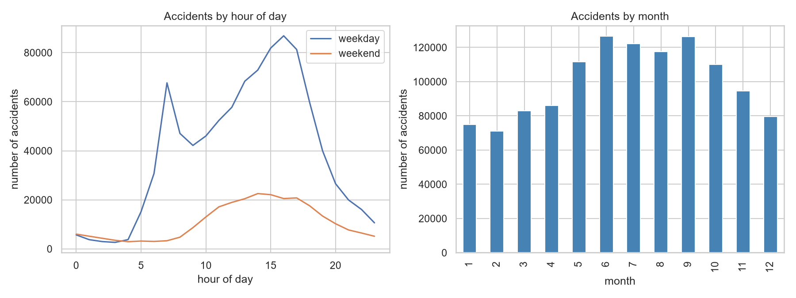
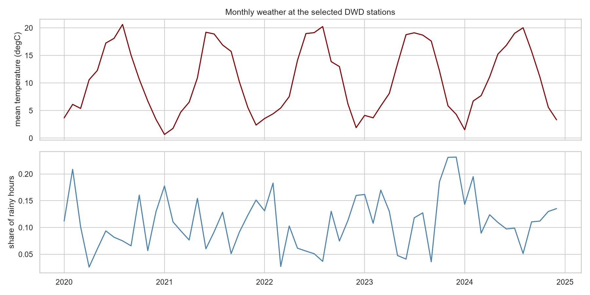
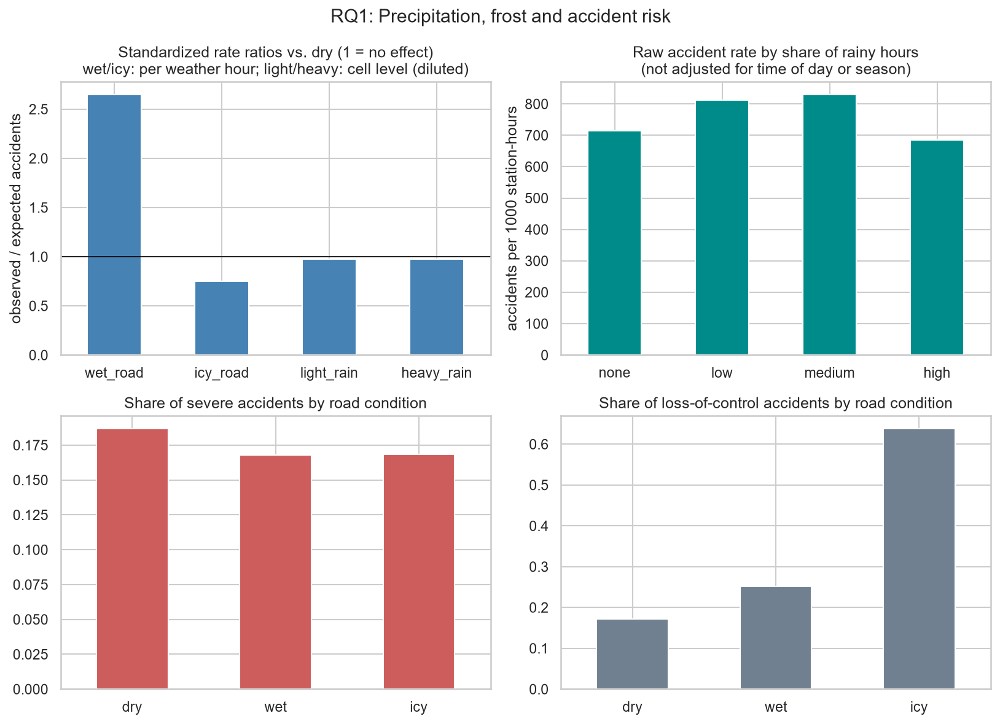
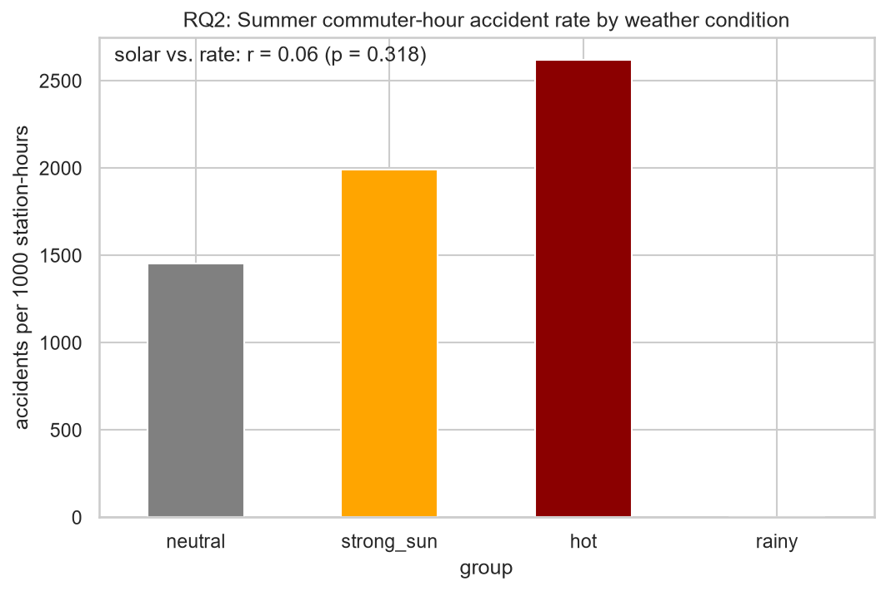
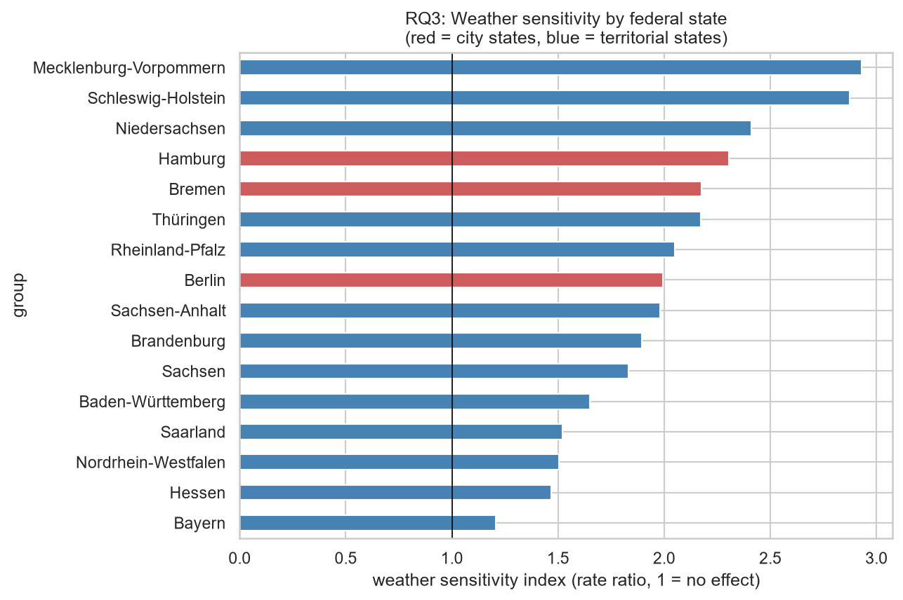
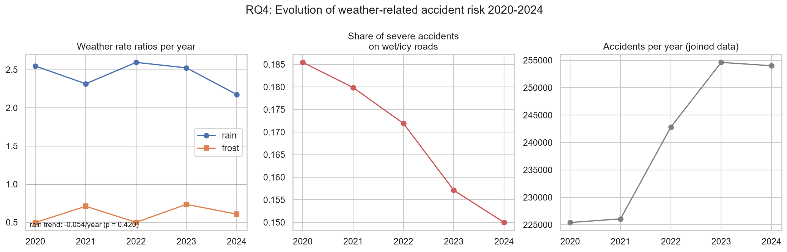

# Weather-Driven Traffic Accident Risk in Germany - Results

This report was generated automatically by the Snakemake workflow.

## Data overview

- Accidents analysed (2020-2024, joined to a weather station): **1,202,912**
- DWD weather stations used: **32** (median distance accident -> station: 43.2 km)

## RQ1: How do precipitation and frost impact accident frequency, severity and type?

Accidents on wet roads happened **2.65 times** as often per rainy hour as dry-road accidents per dry hour (controlling for station, month, weekday/weekend and hour of day). On icy roads in winter the factor was **0.75** per frost hour - below 1, because most frost hours have gritted or simply dry roads and people drive more carefully. The intensity matters: comparing time cells with only light rain (ratio 0.98) to cells that saw heavy rain >= 4 mm/h (ratio 0.98) shows a stronger increase for heavy rain (cell-level ratios are diluted because every cell also contains dry hours). The character of accidents changes too: on icy roads 63.8 % were loss-of-control accidents compared to 17.2 % on dry roads. Severity shows the opposite pattern - 16.8 % of accidents on icy roads were severe vs. 18.7 % on dry roads (chi-square p = 8.9e-122), presumably because drivers slow down.

## RQ2: Do summer sun and heat predict commuter-hour accident rates?

During summer commuter hours (standardized within station, month and hour), cells dominated by strong sunshine had **1.04 times** the accident rate of neutral conditions, hot cells 1.02 times and rainy cells nan times. Across station-months the correlation between mean solar radiation and the commuter accident rate was r = 0.06 (p = 0.318). So neither sun glare nor heat raised commuter accident rates measurably - summer rain remains the more relevant factor (see RQ1).

## RQ3: Which federal states are most weather-sensitive?

The most weather-sensitive states were **Mecklenburg-Vorpommern** (index 2.93) and **Schleswig-Holstein** (2.87); the least sensitive was Bayern (1.21). On average the city states (Berlin, Hamburg, Bremen) had a sensitivity index of 2.16 compared to 1.96 for the territorial states.

## RQ4: How did weather-related risk evolve over the analysis period?

The rain rate ratio went from 2.55 in 2020 to 2.17 in 2024. Over the whole period the ratio decreased by 0.054 per year, which is not statistically significant (p = 0.420) - rain remained roughly equally dangerous. What did change is the outcome: the share of severe accidents on wet or icy roads fell steadily from 18.5 % in 2020 to 15.0 % in 2024, which is consistent with modern vehicle safety technology softening the consequences of weather-related accidents rather than preventing them.

## Limitations

- The Unfallatlas does not contain exact accident dates, only year, month, hour and weekday. Weather exposure is therefore matched on aggregated time cells, which dilutes the true hourly weather effect (the reported ratios are conservative).
- Only a subset of DWD stations measures all three weather parameters, so accidents are matched to stations that can be tens of kilometres away.
- Accident data of some states (e.g. Mecklenburg-Vorpommern in early years) is incomplete in the Unfallatlas.
